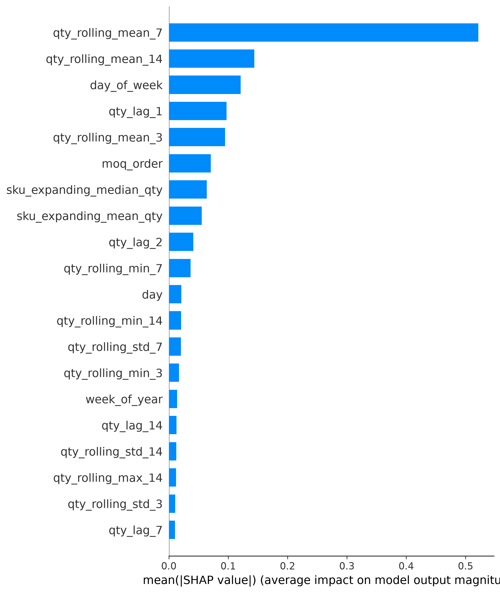
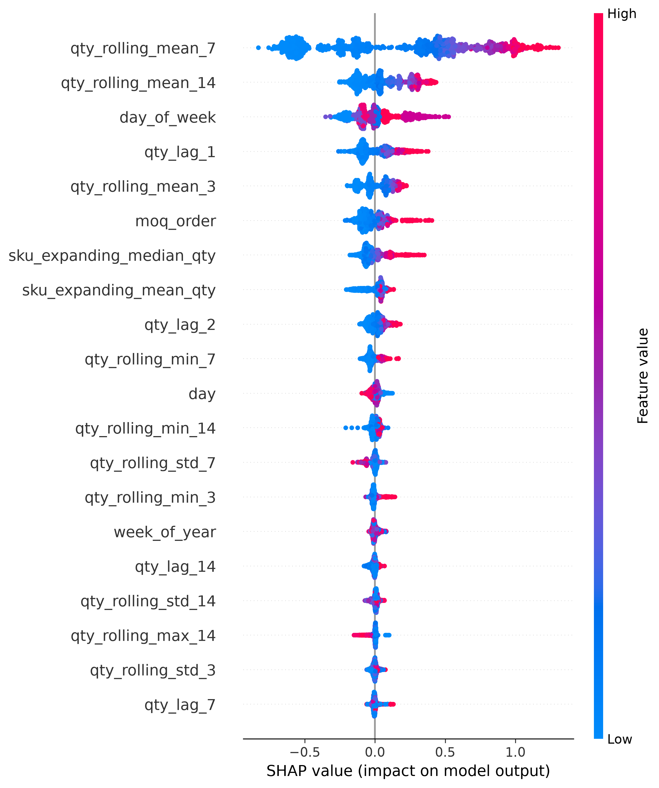

# SKU Sales Forecasting with Machine Learning & SHAP

## 1. Overview

This project builds a machine learning pipeline to forecast SKU-level sales quantity for an e-commerce business.

The business objective is to support inventory planning and purchasing decisions by reducing reliance on manual demand estimation.

```text
Input:  Date + SKU
Output: Predicted sales quantity
```

The project also uses SHAP to explain what drives the model predictions, making the forecast more understandable for business users.

---

## 2. Business Problem

Poor demand forecasting can lead to:

* Stockouts for fast-selling SKUs
* Overstock for slow-moving SKUs
* Inefficient purchasing decisions
* Higher inventory holding costs
* Lower customer satisfaction due to product unavailability

This project helps estimate future SKU demand using historical sales patterns.

---

## 3. Dataset

The raw dataset contains historical transaction-level sales records across multiple SKUs and sales channels.

| Item                |  Value |
| ------------------- | -----: |
| Raw records         | 48,363 |
| Original SKUs       |    676 |
| Sales channels      |      6 |
| Observed dates      |    184 |
| Final modeling SKUs |    180 |
| Final modeling rows | 29,004 |

The raw data was aggregated to the forecasting grain:

```text
shipped_date + sku
```

This means that if the same SKU appeared in multiple channels on the same date, its quantity was summed into one Date-SKU record.

---

## 4. ML Process


Key modeling decisions:

* Aggregated transaction data to Date-SKU level.
* Removed negative quantity records as likely returns or corrections.
* Did not fill missing calendar dates with zero because the data was observed every 2 days.
* Selected SKUs with at least 120 active selling days to ensure enough historical observations.
* Used time-based split instead of random split.
* Used lag, rolling, and SKU historical features.
* Excluded `revenue`, `cost_of_good_sold`, and `channel_count` from model training to avoid potential data leakage.

---

## 5. Feature Engineering

Main feature groups:

| Feature group    | Examples                                             | Purpose                     |
| ---------------- | ---------------------------------------------------- | --------------------------- |
| Date features    | `day_of_week`, `month`, `is_weekend`                 | Capture calendar patterns   |
| Lag features     | `qty_lag_1`, `qty_lag_7`, `qty_lag_14`               | Capture previous demand     |
| Rolling features | `qty_rolling_mean_7`, `qty_rolling_mean_14`          | Capture recent demand trend |
| SKU history      | `sku_expanding_mean_qty`, `sku_expanding_median_qty` | Capture SKU-level behavior  |

Rolling and expanding features were shifted before calculation to prevent leakage from the target period.

The target variable was transformed using:

```text
qty_log = log1p(qty)
```

The model was trained on the log-transformed target, and predictions were converted back to the original quantity scale for evaluation and business interpretation.

---

## 6. Models & Results

Models tested:

* Baseline Lag 1
* Random Forest
* XGBoost
* LightGBM
* Tuned LightGBM

Final model:

```text
Final_LightGBM_V1_Tuned_1
```

Final model configuration:

| Item                | Value                    |
| ------------------- | ------------------------ |
| Base model          | LightGBM                 |
| Target type         | Log-transformed quantity |
| Feature set         | `sales_features_v1`      |
| Number of features  | 29                       |
| Train end date      | 2021-08-19               |
| Validation end date | 2021-10-26               |
| Test WAPE           | 45.30%                   |

Final model comparison:

| Model                              | Dataset  |       WAPE |
| ---------------------------------- | -------- | ---------: |
| Old LightGBM                       | Old test |     45.54% |
| Improvement Attempt 1 - Feature V2 | Test     |     51.46% |
| Final LightGBM V1 Tuned 1          | Test     | **45.30%** |

The final tuned LightGBM achieved the best test WAPE at **45.30%**.

One important learning from model improvement was that adding more features did not always improve model performance. The extended feature set V2 performed worse, while the simpler V1 feature set generalized better on the test period.

---

## 7. Forecast Output Sample

The final model generates SKU-level forecasts on the test set.

| shipped_date | sku    | actual_qty | predicted_qty | absolute_error |
| ------------ | ------ | ---------: | ------------: | -------------: |
| 2021-10-26   | 089A0E |        340 |         85.12 |         254.88 |
| 2021-10-30   | 089A0E |        690 |         82.07 |         607.93 |
| 2021-11-01   | 089A0E |        430 |        173.30 |         256.70 |
| 2021-11-05   | 089A0E |      1,030 |        294.24 |         735.76 |
| 2021-11-07   | 089A0E |      1,180 |        207.89 |         972.11 |
| 2021-11-09   | 089A0E |        860 |        235.69 |         624.31 |
| 2021-11-11   | 089A0E |        700 |        273.71 |         426.29 |
| 2021-11-13   | 089A0E |        320 |        303.71 |          16.29 |

The full forecast output is saved at:

```text
05_outputs/forecasts/final_test_forecasts.csv
```

The forecast file includes:

```text
shipped_date
sku
actual_qty
predicted_qty
absolute_error
```

---

## 8. Explainability with SHAP

SHAP was used to explain which features drive the final model's forecasts.

Since the final model was trained on the log-transformed target, SHAP values explain the model output on the log scale. For business interpretation, positive SHAP values can be understood as pushing the forecast higher, while negative SHAP values push it lower.

### Global Feature Importance



Top SHAP drivers:

```text
qty_rolling_mean_7
qty_rolling_mean_14
day_of_week
```

The strongest driver is `qty_rolling_mean_7`, meaning the recent average SKU demand is the most important signal for future demand.

### Feature Impact Direction



Key interpretation:

* Higher recent rolling demand generally increases the forecast.
* Lower recent rolling demand usually reduces the forecast.
* Rolling averages provide a more stable demand signal than using only one previous sales period.
* `day_of_week` suggests that weekday patterns affect SKU demand.
* SKU-level historical behavior helps distinguish high-demand and low-demand SKUs.

---

## 9. Business Insights

1. **Recent demand trend is the strongest signal.**
   The model relies most on rolling average sales, especially `qty_rolling_mean_7`.

2. **A single previous value is not enough.**
   The model improves forecasting by combining lag features, rolling averages, and SKU-level historical behavior.

3. **Fast-moving SKUs should be monitored more closely.**
   SKUs with rising recent rolling demand may need earlier replenishment to reduce stockout risk.

4. **More features do not always mean better performance.**
   The extended feature set V2 performed worse than the simpler V1 feature set, showing the importance of validation-based model selection.

5. **Forecasts should support, not replace, business decisions.**
   Purchasing decisions should still consider inventory level, supplier lead time, promotions, stock availability, and business priorities.

---

## 10. Project Structure

```text
SKU_Sales_Forecasting_ML_Pipeline/
│
├── 01_data/
│   ├── raw/
│   ├── processed/
│   └── features/
│
├── 02_notebooks/
│   ├── 01_eda.ipynb
│   ├── 02_feature_engineering.ipynb
│   ├── 03_model_training.ipynb
│   ├── 04_model_improvement.ipynb
│   └── 05_shap_explainability.ipynb
│
├── 03_src/
│   ├── data_preprocessing.py
│   ├── feature_engineering.py
│   ├── train_model.py
│   ├── evaluate_model.py
│   ├── predict.py
│   └── explain_model.py
│
├── 04_models/
│   ├── final_sales_forecasting_model.pkl
│   ├── final_feature_columns.json
│   └── final_model_info.json
│
├── 05_outputs/
│   ├── model_results/
│   ├── forecasts/
│   └── figures/
│
├── README.md
├── requirements.txt
└── .gitignore
```

---

## 11. Key Outputs

| Output                                                 | Description                          |
| ------------------------------------------------------ | ------------------------------------ |
| `01_data/features/sales_features.csv`                  | Final ML feature dataset             |
| `04_models/final_sales_forecasting_model.pkl`          | Final trained LightGBM model         |
| `04_models/final_feature_columns.json`                 | Final feature list used by the model |
| `04_models/final_model_info.json`                      | Final model metadata and parameters  |
| `05_outputs/forecasts/final_test_forecasts.csv`        | Forecast output on the test set      |
| `05_outputs/model_results/final_model_comparison.csv`  | Final model performance comparison   |
| `05_outputs/model_results/business_shap_summary.csv`   | Business-level SHAP summary          |
| `05_outputs/model_results/shap_feature_importance.csv` | SHAP feature importance table        |
| `05_outputs/figures/shap_bar_plot.png`                 | SHAP global feature importance       |
| `05_outputs/figures/shap_summary_plot.png`             | SHAP feature impact direction        |

---

## 12. Limitations

* The data is observed every 2 days, not every calendar day.
* Only SKUs with enough historical observations were modeled.
* Promotion, pricing, holiday, stock level, supplier lead time, and marketing features were not available.
* SKU-level demand is noisy, and some individual SKU-date predictions still have large errors.
* Forecast output should be combined with inventory rules such as safety stock, reorder points, and supplier lead time.

---

## 13. Conclusion

This project demonstrates an end-to-end SKU-level sales forecasting workflow with explainable machine learning.

The main value is not only the final model result, but the ML thinking behind the pipeline:

```text
right forecasting grain
time-based validation
leakage-safe features
baseline comparison
model improvement
SHAP explainability
forecast output generation
```

The final tuned LightGBM achieved **45.30% WAPE** on the test set. SHAP analysis shows that recent rolling SKU demand, especially `qty_rolling_mean_7`, is the strongest driver of the forecast.
